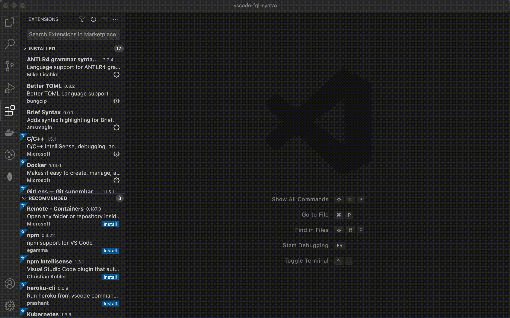

# Syntax Highligher for Ferrer Query Language

Provides basic syntax highlighting for FQL. This repository was originally inspired and bootstrapped from [vscode-aql](https://github.com/monotykamary/vscode-aql)

## Install

1. Type **"Ferret"** in Extensions tab
2. Search **"Ferret Syntax Highligh"** extension
3. Click **Install**

