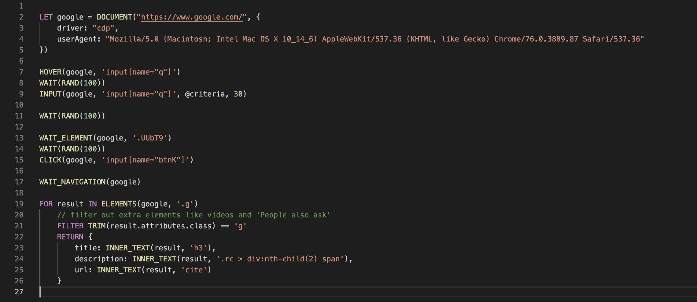

# Syntax Highligher for Ferrer Query Language

Provides basic syntax highlighting for FQL. This repository was originally inspired and bootstrapped from [vscode-aql](https://github.com/monotykamary/vscode-aql)

## Install

1. Type **"Ferret"** in Extensions tab
2. Search **"Ferret Syntax Highligh"** extension
3. Click **Install**

https://user-images.githubusercontent.com/23486601/130850220-85653c30-b674-456e-86a4-454b9f9472e1.mov

## Run FQL file from VS Code

1. Open tab with FQL script file
2. Open **Command Palette** with `⇧⌘P`
3. Type `Ferret: Run File`

https://user-images.githubusercontent.com/23486601/130849744-d2ec8183-0874-4f61-bc89-59c492a7d4e3.mov
